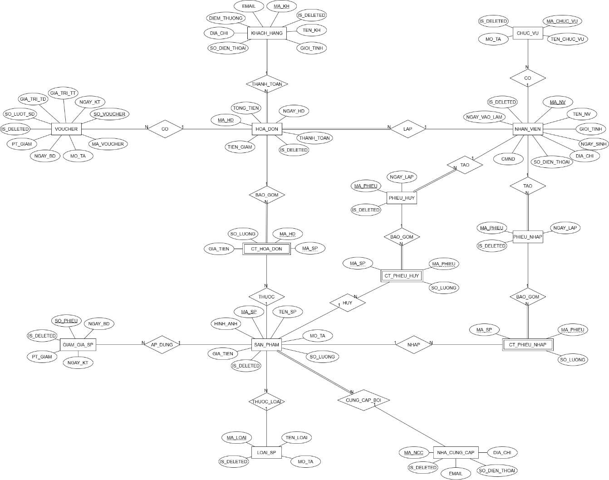
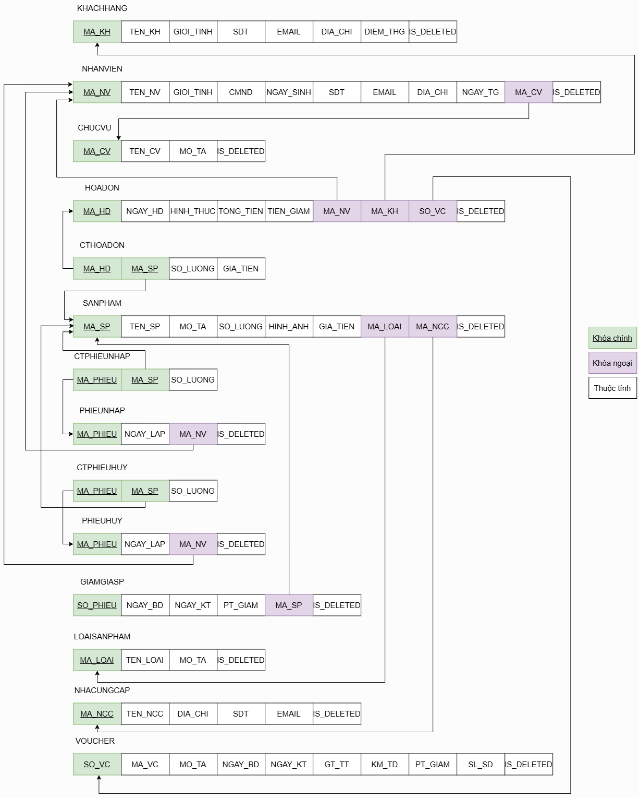

# 🛒 Hệ Thống Quản Lý Siêu Thị Mini (MINI SUPERMARKET MANAGEMENT)
# [ **Đồ án môn học: Cơ sở dữ liệu] _ Cô: Nguyễn Thị Tuyết Hải** - **Học viện Công nghệ Bưu chính Viễn thông cơ sở TP Hồ Chí Minh**  


## 📖 Giới thiệu chung
Đồ án này tập trung xây dựng lớp dữ liệu tối ưu và chặt chẽ cho hệ thống quản lý **Siêu Thị Mini**. 
* **Giao diện (Frontend):** Được kế thừa và tái sử dụng từ đồ án môn Lập trình hướng đối tượng (OOP) để tập trung nguồn lực vào xử lý dữ liệu backend.
* **Cơ sở dữ liệu (Backend):** Được thiết kế mới hoàn toàn, chuẩn hóa đạt **Dạng chuẩn 3 (3NF)** và xử lý truy vấn thông qua thư viện hỗ trợ JDBC gọn nhẹ.

## 🛠 Công nghệ & Công cụ
| Thành phần | Công nghệ sử dụng |
| :--- | :--- |
| **Ngôn ngữ** | Java (JDK 8+) |
| **Hệ quản trị CSDL** | MySQL 8.0 |
| **Thiết kế Database** | draw.io |
| **Thư viện truy vấn** | **Apache Commons DbUtils** (JDBC Wrapper) |

## 🗂 Thiết kế Cơ sở dữ liệu (Đạt chuẩn 3NF)

Dữ liệu được tổ chức để đảm bảo tính toàn vẹn và loại bỏ dư thừa.


**1. Lược đồ E-R**



**2. Lược đồ quan hệ**


**Tiêu chuẩn 3NF được áp dụng:**
-  **1NF (Atomic):** Không có thuộc tính đa trị.
-  **2NF** Tất cả thuộc tính không khóa phụ thuộc hoàn toàn vào khóa chính (Tách bảng chi tiết).
-  **3NF** Không có thuộc tính không khóa nào phụ thuộc vào thuộc tính không khóa khác .

---

## 🏗 Kiến trúc Truy vấn & Tương tác CSDL 

Dự án sử dụng thư viện **Apache Commons DbUtils** để đơn giản hóa JDBC, giúp code gọn nhẹ, an toàn và dễ bảo trì. Kiến trúc truy vấn được chia làm 3 thành phần chính:

### 1. QueryRunner (Trình thực thi an toàn)
Đóng vai trò trung gian thực thi các câu lệnh SQL.
* **An toàn bảo mật:** Tự động xử lý `PreparedStatement`, gán các tham số (params) vào dấu `?` để ngăn chặn triệt để tấn công **SQL Injection**.
* **Quản lý tài nguyên:** Tự động đóng kết nối (close connection) sau khi thực thi, tránh rò rỉ tài nguyên.

### 2. Cơ chế Mapping tự động (ResultSetHandler)
Sử dụng **Java Reflection** để tự động ánh xạ (Map) dữ liệu từ cột trong MySQL sang thuộc tính của Java Object (POJO).
* **Cơ chế:** Tên cột `user_name` (DB) $\rightarrow$ `setUserName` (Java).
* **`BeanHandler<T>`:** Dùng để mapping **một dòng kết quả duy nhất** thành một Object.
* **`BeanListHandler<T>`:** Dùng để mapping **tập kết quả** thành một `List<T>` các Object.

### 3. Phân loại nhóm truy vấn
Hệ thống Data Access Object (DAO) được chia thành 2 luồng xử lý rõ ràng:

#### A. Nhóm truy vấn "Đọc dữ liệu" (Read)
* **Mục đích:** `SELECT`.
* **Phương thức:** `queryRunner.query(connection, sql, handler, params)`.
* **Đầu ra:** Trả về Object hoặc List Object tùy thuộc vào Handler được chọn.

#### B. Nhóm truy vấn "Ghi thay đổi" (Write)
* **Mục đích:** `INSERT`, `UPDATE`, `DELETE`.
* **Phương thức:** `queryRunner.update(connection, sql, params)`.
* **Đầu ra:** Trả về số lượng dòng bị ảnh hưởng (int).

---
## ⚙️ Cài đặt và Hướng dẫn chạy (Installation)

1.  **Clone dự án:**
    ```bash
    git clone https://github.com/bitboi-ptit/Database_PTIT.git
    ```
2.  **Cấu hình Cơ sở dữ liệu:**
    - Mở MySQL Workbench.
    - Tạo database mới tên `quanlysieuthi`.
    - Import file `sieuthimini.sql` (nằm trong thư mục `/database` của dự án).
    - Cập nhật thông tin kết nối (user/password) trong file `dbconfig.properties`.
3.  **Mở dự án:**
    - Khởi động NetBeans/IntelliJ IDEA/Visual Studio Code.
    - Open Project -> Chọn thư mục vừa clone.
4.  **Chạy ứng dụng:**
    - Tìm file `App.java` và chọn **Run**.


## 👥 Nhóm thực hiện (Authors)

Dự án được thực hiện bởi nhóm sinh viên lớp cơ sở dữ liệu - PTIT:

| STT | Họ và tên | Mã sinh viên | Vai trò |
| :--- | :--- | :--- | :--- |
| 1 | **Khổng Phú Cường** | N23DCCN076 | Trưởng nhóm |
| 2 | **Lê Mạnh Hùng** | N23DCCN091 | Thành viên |
| 3 | **Đinh Việt Quân** | N23DCCN116 | Thành viên |
| 4 | **Hồ Duy Nhất** | N23DCCN111 | Thành viên |
| 5 | **Nguyễn Khánh Nguyên** | N23DCCN109 | Thành viên |
